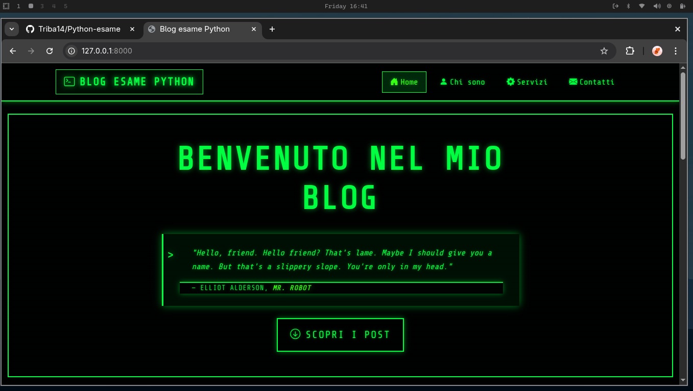
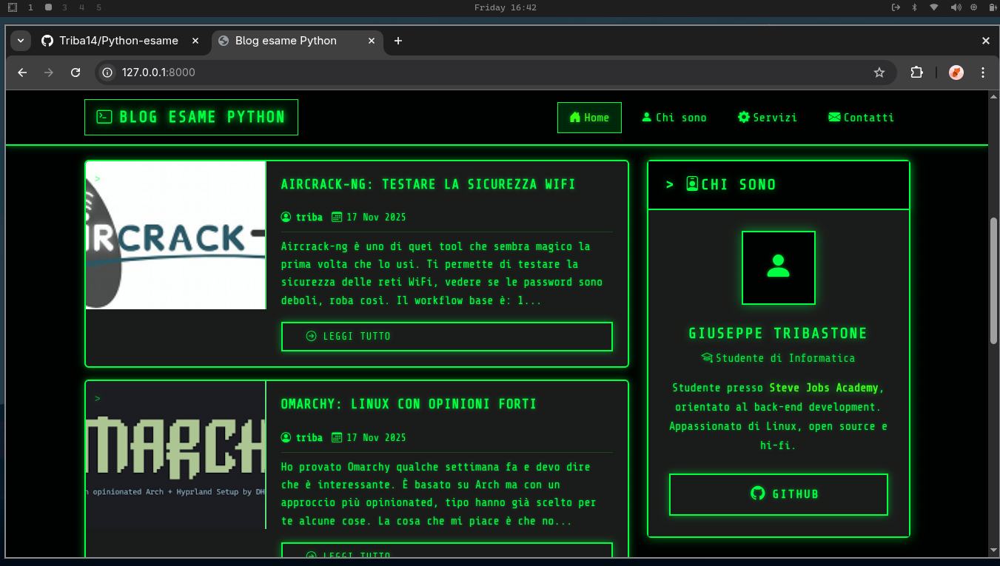
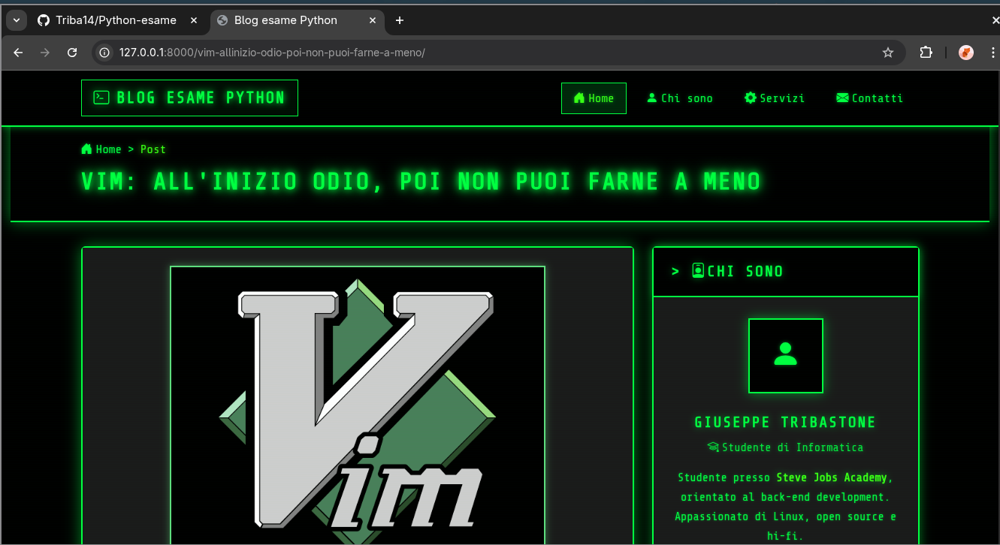
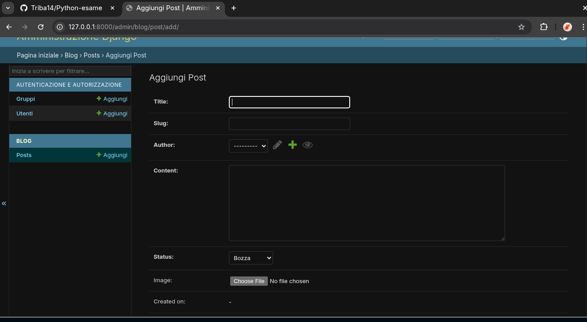
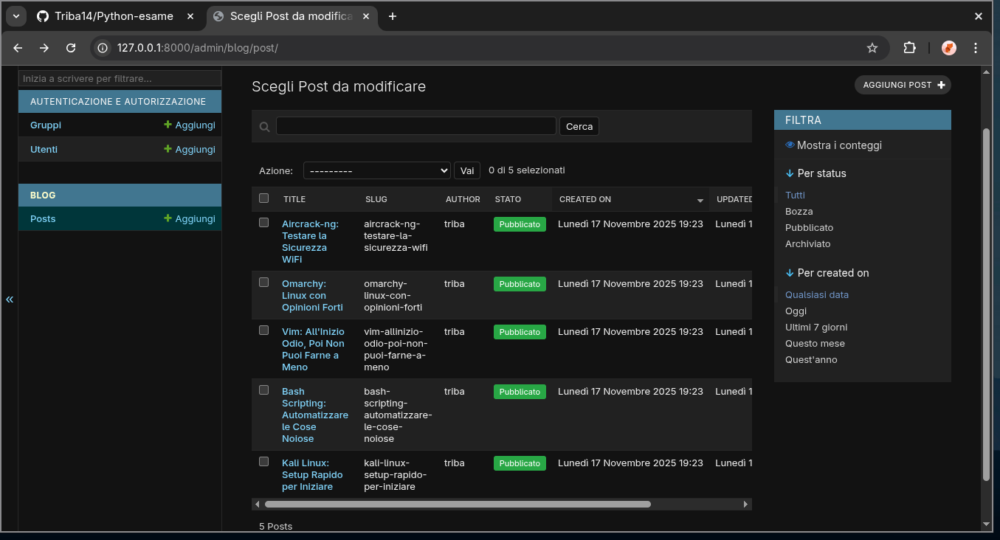

# Blog Django

Blog fatto con Django. Si possono creare, vedere, modificare e cancellare i post.

## Funzionalità

- Creare nuovi post dall'admin
- Vedere tutti i post pubblicati nella homepage
- Leggere i dettagli di ogni post
- Modificare i post dall'admin
- Cancellare i post dall'admin
- Aggiungere immagini ai post

## Come farlo partire

Installa le librerie:
```
pip install -r requirements.txt
```

Vai nella cartella mysite:
```
cd mysite
```

Fai le migrazioni:
```
python manage.py migrate
```

Crea un utente admin:
```
python manage.py createsuperuser
```

Avvia il server:
```
python manage.py runserver
```

Poi apri http://127.0.0.1:8000/ nel browser

## Screenshot











